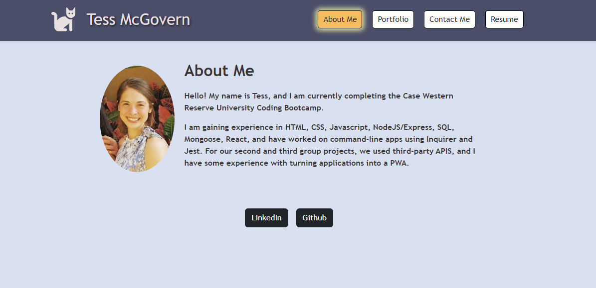

# Professional Porfolio Revisted

## Description
> For one of our first challenges in the CWRU coding bootcamp, we used basic HTML and CSS to create a professional portfolio.  Now, for one of our last challenges, we are creating a portfolio using React and a more polished UI.

## Table of Contents
I. [Acceptance Critera](#acceptance-criteria)
II. [Deployed Site](https://lambent-croquembouche-17ea12.netlify.app/)
III. [Image of Site](#image-of-site)

## Acceptance Criteria
> - GIVEN an SPA (single-page application) portfolio
> - When I load the portfolio
>   - Then I am presented with a page containing:
>       - a header
>       - a section for content
>       - a footer
> - When I view the **header**
>   - Then I am presented with:
>       - developer's name
>       - navigation with titles
> - When I view the **navigation titles**
>   - Then I am presented with the following options for **Sections** (which highlight when displayed):
>       - About Me
>            - Recent photo or avatar of developer and a short bio
>       - Portfolio
>            - Six images of applications with links
>       - Contact
>            - Form with fields for a name, email address, and message
>       - Resume
>            -Downloadable resume
> - When I load the portfolio for the first time, the About Me is selected by default
> - The **Footer** contains links to Github, LinkedIn, and any other platforms

## Image of Site

## Deployed Site
[Click Here to Visit](https://lambent-croquembouche-17ea12.netlify.app/)
